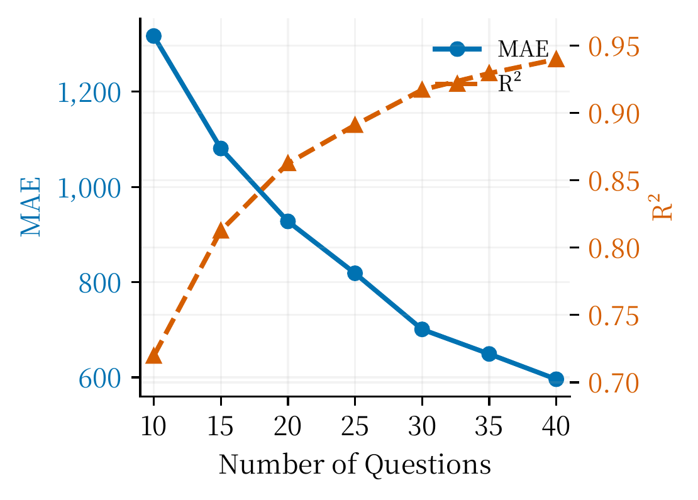
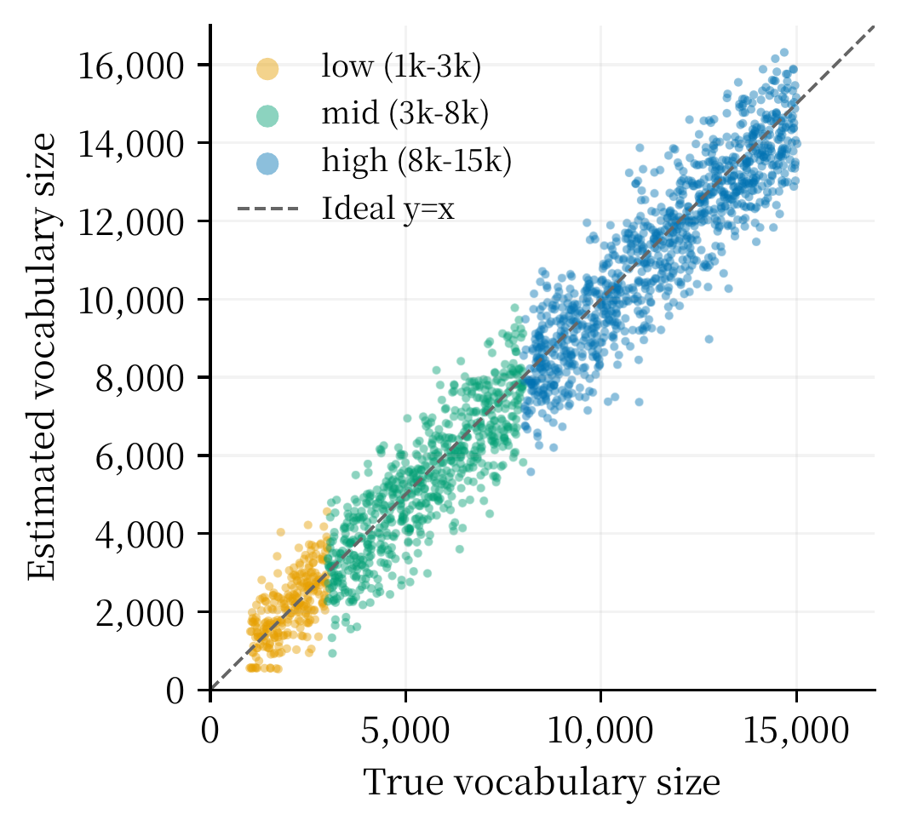
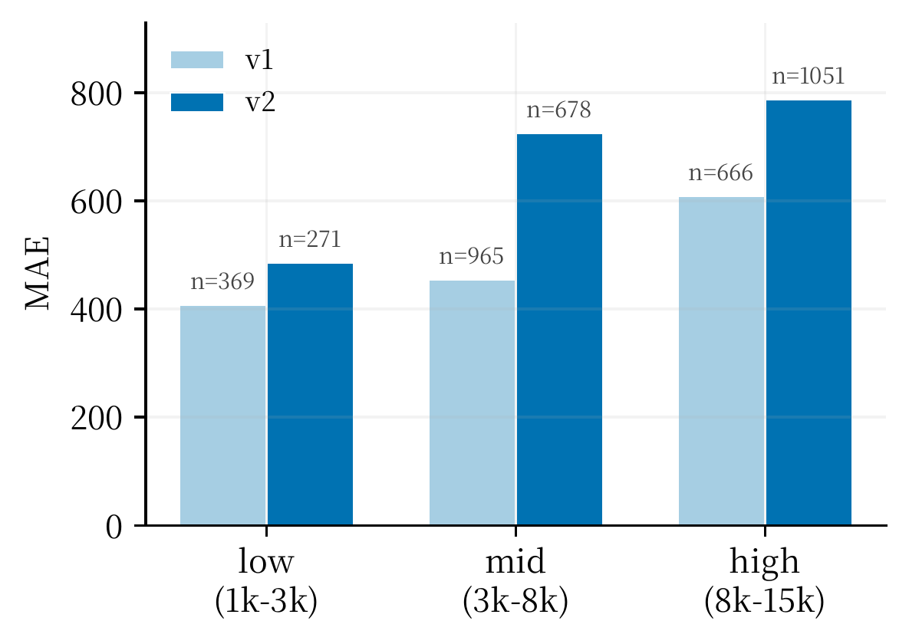
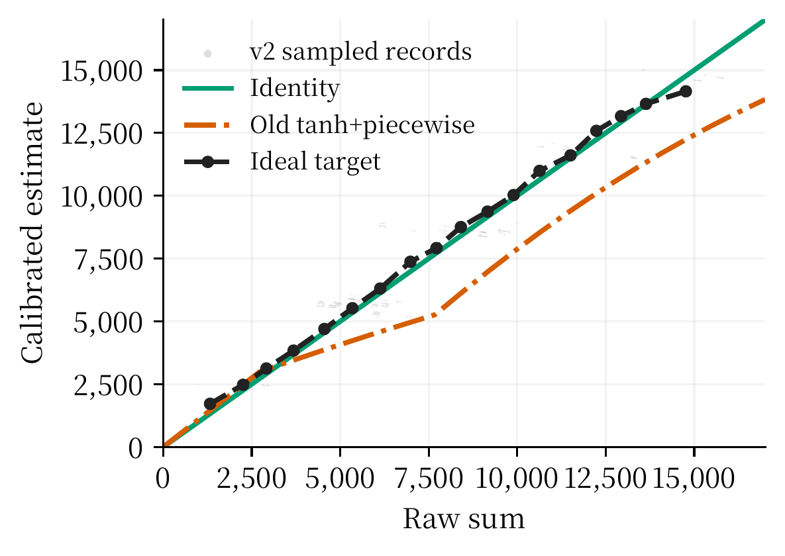
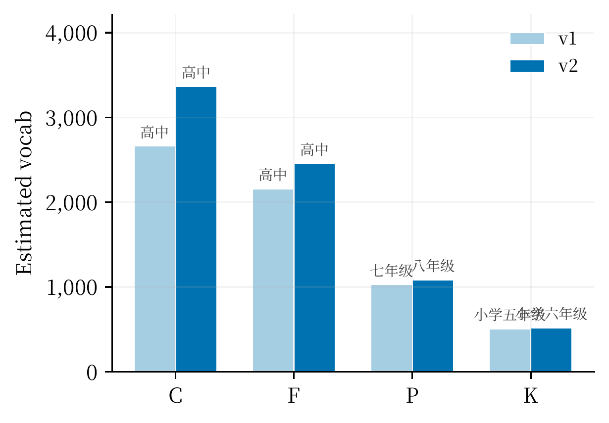

# 英语词汇量估算工具 / English Vocabulary Size Estimator

面向中国英语学习者的词汇量估算系统，支持两条互补流程：

- **选择题测验 / Quiz-based estimation**: 用户回答单词释义选择题，系统用 Rasch 1PL IRT 模型估计个人词汇量。
- **文章估算 / Article-based estimation**: 用户输入英文文章，系统根据文章词汇难度分布估计读懂该文本所需的词汇量门槛。

The project is a full-stack vocabulary-size estimator with a FastAPI backend, a static web frontend, SQLite persistence, multiple vocabulary-bank versions, reproducible simulation experiments, and production deployment notes.

---

## 1. 项目简介 / Project Overview

本项目从课程设计需求出发，目标是构建一个可解释、可复现实验、可部署演示的英语词汇量估算工具。系统既可以通过主动测验估计“某个用户大约认识多少词”，也可以通过文章分析估计“读懂某篇文章大致需要多少词汇储备”。

The main audience is Chinese EFL learners. The system combines education-stage vocabulary lists, word-frequency information, exam vocabulary anchors, Rasch modeling, and article difficulty analysis.

核心能力如下：

| 能力 / Capability | 中文说明 | English Summary |
| :--- | :--- | :--- |
| 选择题测验 | 按难度分层抽题，支持 v1/v2 词库版本切换 | Stratified quiz with versioned vocabularies |
| Rasch 估计 | 用用户能力参数和单词难度参数拟合答题结果 | Rasch 1PL ability fitting |
| 置信区间 | 基于 Fisher 信息量给出能力和词汇量区间 | Confidence interval from Fisher information |
| 文章估算 | 分词、停用词过滤、lemma 归一化、累计百分位估算 | Passive article vocabulary requirement |
| 数据保存 | SQLite 保存学生和测试记录 | SQLite records for students and tests |
| 批处理实验 | 合成用户模拟、题量消融、词库校准和 C/F/P/K 对比 | Reproducible evaluation scripts |
| 部署闭环 | nginx + systemd + uvicorn + FastAPI | Production deployment path |

当前推荐主线是 `stage_vocab` 系列词库上的 Rasch 分层测验，以及 `v2` 词库上的文章估算。旧版 `wordfreq` 频段桶模型仍作为历史兼容路径保留。

---

## 2. 核心原理 / Core Principles

### 2.1 Rasch 1PL IRT 模型

选择题测验使用 Rasch 1PL 项目反应理论模型。每个用户有一个能力参数 `theta`，每个词有一个难度参数 `d_j`。模型把“用户能力”和“词难度”放在同一条 logit 标尺上比较。

```text
P(word_j known | theta) = sigma(theta - d_j)

sigma(x) = 1 / (1 + exp(-x))

d_j = logit(difficulty_j)

logit(p) = log(p / (1 - p))
```

含义：

- 当 `theta = d_j` 时，认识该词的概率为 0.5。
- 当 `theta > d_j` 时，用户更可能认识该词。
- 当 `theta < d_j` 时，用户更可能不认识该词。
- 单词越接近用户能力边界，Fisher 信息量越大，对估计越有帮助。

### 2.2 对数似然与能力拟合

用户作答记录记为若干个 `(word_j, y_j)`，其中 `y_j` 为 1 表示答对或认识，为 0 表示答错或不认识。系统最大化 Rasch 对数似然，并加入先验防止全对或全错时能力参数发散。

```text
LL(theta) =
  sum_j [
    y_j * log(sigma(theta - d_j))
    + (1 - y_j) * log(1 - sigma(theta - d_j))
  ]
```

Newton-Raphson 更新的核心形式为：

```text
theta_next =
  theta_current
  + sum_j(y_j - sigma(theta_current - d_j))
    / sum_j[sigma(theta_current - d_j) * (1 - sigma(theta_current - d_j))]
```

实现中使用多起点 MAP / Newton-Raphson 迭代，降低极端作答和初始值不佳带来的数值风险。

### 2.3 Fisher 信息量与置信区间

单题信息量在概率接近 0.5 时最大；过易或过难的题对定位能力贡献较小。

```text
I_i(theta) = sigma(theta - d_i) * (1 - sigma(theta - d_i))

SE(theta) = 1 / sqrt(sum_i I_i(theta))

95% CI(theta) = theta +/- 1.96 * SE(theta)
```

系统再把 `theta` 区间两端映射为词汇量区间，形成前端展示的置信范围。

### 2.4 词汇量估算公式

拟合得到能力参数后，系统不做硬阈值计数，而是对词库中每个词的认识概率求和。这样可避免把 0.49 和 0.51 这类边界概率硬切成“不认识”和“认识”。

```text
raw_vocab = sum_j sigma(theta - logit(difficulty_j))

vocab_size_v1 = raw_vocab * 0.8

vocab_size_v2 = raw_vocab
```

`v1` 的 `0.8` 是旧量表经验校准系数，用于补偿早期词库和合成训练带来的偏高风险。`v2` 校准实验显示 raw sum 已接近最优，因此推荐使用直接 raw sum，不再套用旧式强校准。

### 2.5 难度评分公式

词难度综合教育阶段与词频 rank。教育阶段保证与中国学习路径一致，词频 rank 用于拉开同一阶段内部差异。

```text
difficulty = 0.60 * norm_stage + 0.40 * norm_rank

norm_stage = (priority - 1) / 10

norm_rank = log(rank + 1) / log(30001)
```

The 60/40 split keeps education-stage ordering dominant while preserving enough frequency-based spread inside each stage.

---

## 3. 系统架构 / System Architecture

系统按数据层、模型层、API 层、前端层和部署层组织。

```text
User Browser
  |
  v
nginx reverse proxy
  |
  v
systemd: vocab-estimator
  |
  v
uvicorn FastAPI
  |
  +-- GET  /
  +-- GET  /api/vocabulary/quiz-v2
  +-- POST /api/vocabulary/quiz-v2/stream
  +-- POST /api/vocabulary/quiz-v2/estimate
  +-- POST /api/vocabulary/quiz-v2-stage2
  +-- POST /api/v2/estimate/article
  +-- POST /api/tests/save
  +-- GET  /api/tests/records
  |
  +-- Data Layer
      +-- data/stage_vocab*.json
      +-- data/vocab_estimator.sqlite3
      +-- server/translations.py
```

| 层 / Layer | 主要文件 / Files | 职责 / Responsibility |
| :--- | :--- | :--- |
| 数据层 / Data | `data/stage_vocab*.json`, `data/exam_vocab/`, `data/vocab_estimator.sqlite3` | 词库、考纲词表、测试记录 |
| 模型层 / Model | `vocab_estimator/stratified_quiz.py`, `vocab_estimator/article_estimator.py`, `vocab_estimator/vocab_model.py` | Rasch 测验、文章估算、旧版兼容估计 |
| API 层 / API | `server/main.py`, `server/database.py` | FastAPI 端点、版本映射、记录保存 |
| 前端层 / Frontend | `web/index.html`, `web/app.js`, `web/styles.css` | 测验流程、文章输入、结果展示 |
| 实验层 / Experiments | `tests/simulation_eval.py`, `scripts/*.py`, `outputs/*.json` | 模拟评估、题量消融、词库扩展、校准 |
| 部署层 / Deployment | `run.sh`, nginx, systemd, uvicorn | 本地运行和生产部署 |

---

## 4. 双估算流程 / Two Estimation Flows

选择题测验和文章估算共享词库与 difficulty 标尺，但不是同一个模型的两个参数设置。它们的输入、概率假设和输出含义不同。

| 对比项 / Aspect | 选择题测验 / Quiz | 文章估算 / Article |
| :--- | :--- | :--- |
| 输入 | 用户对单词题的对错记录 | 一篇英文文章 |
| 输出含义 | 这个用户大约认识多少词 | 读懂这篇文章大致需要多少词 |
| 核心模型 | Rasch 1PL IRT | 累计百分位法 |
| 是否估计 `theta` | 是 | 否 |
| 是否有置信区间 | 有，来自 Fisher 信息量 | 通常无，仅报告覆盖率和统计量 |
| 典型 API | `/api/vocabulary/quiz-v2/estimate` | `/api/v2/estimate/article` |
| 适用边界 | 需要用户答题，适合个人能力测量 | 不测用户能力，只测文本阅读门槛 |

### 4.1 选择题测验流程 / Quiz Flow

```text
1. 前端请求 /api/vocabulary/quiz-v2
2. 后端按 cluster_20 难度层分层抽题
3. 用户完成中文释义选择题或 fallback binary 题
4. 前端提交 responses 到 /api/vocabulary/quiz-v2/estimate
5. 后端拟合 theta，计算 raw vocabulary sum
6. 后端输出 point_estimate、level、confidence、confidence_interval
7. 可选调用 /api/tests/save 保存测试记录
```

当前配置默认 `phase1_question_count=30`，并保留 `question_count` 参数用于 1 到 40 题之间的实验路径。设计文档中曾提出 60 题和 Phase 2 精化方案；后续实验显示 30 到 40 题之间边际收益已经明显下降，因此演示流程偏向较短的 streaming 测验。

### 4.2 文章估算流程 / Article Flow

文章估算不反推用户能力，只根据文章中命中的内容词 difficulty 分布估计阅读门槛。

```text
1. 正则分词，保留英文 token 和部分连字符词
2. 转小写，过滤停用词和明显噪声
3. 规则 lemma 归一化，匹配 stage vocabulary
4. 收集命中词的 difficulty
5. 计算 p25、median、p75、p95、mean、max
6. 使用尾部加权 difficulty 计算累计词汇量
```

文章估算的当前推荐公式：

```text
weighted_diff = 0.8 * p75 + 0.2 * p95

estimated_vocab = count(vocab_word.difficulty <= weighted_diff)
```

This should be read as a text requirement estimate, not as a learner ability estimate.

---

## 5. 词库体系 / Vocabulary Versions

项目保留四个主要 stage vocabulary 版本，用于生产回退、文章估算、v2 迁移和实验复现。

| 版本 / Version | 文件 / File | 词数 / Size | 定位 / Role | 说明 / Notes |
| :--- | :--- | ---: | :--- | :--- |
| v1 | `data/stage_vocab.json` | 11,418 | 原始基准词库 | 国内阶段词表与考试词表融合，旧量表稳定 |
| enhanced | `data/stage_vocab_enhanced.json` | 19,801 | 扩展过渡词库 | 加入 COCA、TOEFL、GRE 和现代领域词，提升文章覆盖率 |
| v2 | `data/stage_vocab_v2.json` | 19,801 | 统一标定词库 | 重新计算 difficulty，避免新增词简单 boost 导致量表断层 |
| v2_clusterv1 | `data/stage_vocab_v2_clusterv1.json` | 19,801 | 当前 v2 测验语义 | 使用 v1 difficulty 边界稳定聚类，兼顾扩展词库和历史对比 |

当前服务端还有清洗后的运行时别名：

| 前端参数 / Frontend Param | 后端规范名 / Canonical | 当前映射 / Runtime Path |
| :--- | :--- | :--- |
| `vocab_version=v1` | `v1` | `data/stage_vocab_clean_v1.json` |
| `vocab_version=original` | `v1` | `data/stage_vocab_clean_v1.json` |
| `vocab_version=v2` | `v2_clusterv1` | `data/stage_vocab_clean_v2.json` |
| `vocab_version=v2_clusterv1` | `v2_clusterv1` | `data/stage_vocab_clean_v2.json` |

词库扩展的主要收益：

| 外部词表 / External List | 扩展前覆盖 | 扩展后覆盖 | 说明 |
| :--- | ---: | ---: | :--- |
| COCA20000 | 55.51% | 98.48% | 开放域文章覆盖明显提升 |
| TOEFL | 69.97% | 99.97% | 高阶阅读词汇基本补齐 |
| GRE | 38.96% | 72.15% | 保守纳入现代文章有用的高阶词 |
| CET6 | 100.00% | 100.00% | 原始词库已覆盖 |
| 高考 | 100.00% | 100.00% | 原始词库已覆盖 |

重点补入词包括 `algorithmic`, `blockchain`, `governance`, `mitigation`, `biodiversity`, `hegemony`, `epistemology`, `geopolitical` 等高难文章信号词。

---

## 6. 实验与评估 / Experiments and Evaluation

### 6.1 主模拟评估

主模拟脚本为 `tests/simulation_eval.py`。实验生成 2,000 个合成用户，真实词汇量均匀分布在 1,000 到 15,000 之间。每个用户先反推出真实能力参数，再按 Rasch 概率随机生成作答，最后比较系统估计值与真实词汇量。

```text
true_vocab ~= sum_j sigma(true_theta - d_j)

response_j ~ Bernoulli(sigma(true_theta - d_j))
```

主要结果：

| 实验配置 / Setting | 用户数 | MAE | RMSE | R² | 题量 |
| :--- | ---: | ---: | ---: | ---: | ---: |
| Phase 1 only | 300 | 596 | 729 | 0.940 | 40 |
| Phase 1 + Phase 2 | 2,000 | 363 | 455 | 0.977 | 约 84 |
| Hybrid bisection + CAT | 500 | 443 | - | 0.961 | 40 |
| 25 题初估 | 300 | 819 | 981 | 0.891 | 25 |
| 30 题折中 | 300 | 701 | 855 | 0.917 | 30 |

主基准实验相关系数为 0.989，平均偏差为 -134。完整流程 MAE=363、R²=0.977，接近 Fisher 信息量理论下界 CRLB 约 253 词。



### 6.2 v2 散点与分桶精度

v2 模拟散点图显示估计值与真实词汇量整体贴近理想线，高段存在轻微低估。



2,000 用户完整流程的分桶误差：

| 词汇量区间 / Bucket | 用户数 | MAE | R² | 平均偏差 |
| :--- | ---: | ---: | ---: | ---: |
| 低段 1k-3k | 369 | 334 | 0.447 | +2 |
| 中段 3k-8k | 965 | 374 | 0.896 | -91 |
| 高段 8k-15k | 666 | 363 | 0.796 | -271 |



### 6.3 题量消融

题量消融说明 10 到 30 题阶段收益明显，30 题后边际收益下降。

| 题量 | MAE | RMSE | R² | Corr | 平均偏差 | 词汇 CI 宽 |
| :---: | ---: | ---: | ---: | ---: | ---: | ---: |
| 10 | 1,317 | 1,572 | 0.720 | 0.900 | -851 | 5,455 |
| 15 | 1,081 | 1,286 | 0.813 | 0.927 | -606 | 4,459 |
| 20 | 928 | 1,101 | 0.863 | 0.943 | -469 | 3,797 |
| 25 | 819 | 981 | 0.891 | 0.954 | -380 | 3,452 |
| 30 | 701 | 855 | 0.917 | 0.966 | -346 | 3,133 |
| 35 | 649 | 790 | 0.929 | 0.971 | -310 | 2,888 |
| 40 | 596 | 729 | 0.940 | 0.974 | -258 | 2,678 |

结论：25 题适合快速初估，30 题是演示场景的折中点，40 题提供更高精度。

### 6.4 v2 校准

v2 校准实验表明，旧 v1 的 tanh + piecewise 强校准不适合扩展后的 v2 量表。保守上线策略是 v2 使用 raw sum，不再使用 v1 的 `0.8` 压缩和旧式强校准。

| 方法 / Method | MAE | RMSE | 偏差 | R² | 结论 |
| :--- | ---: | ---: | ---: | ---: | :--- |
| v2 raw sum identity | 725.221 | 918.763 | -178.221 | 0.947932 | 基准且已较好 |
| 当前旧 point_estimate | 1,814.489 | 2,131.239 | -1,701.151 | 0.719828 | v1 校准不适合 v2 |
| OLS 线性 raw sum | 712.379 | 895.953 | 0.000 | 0.950486 | 小幅改善但需真实数据验证 |
| 最优搜索 offset | 691.210 | 879.515 | -28.715 | 0.952286 | 提升有限且可能过拟合 |



### 6.5 主要限制

当前实验主要来自合成用户模拟和固定 C/F/P/K 语料，仍缺少真实学生 CET-4/6、考研或雅思成绩的交叉验证。v2 测验量表和文章估算的 p75/p95 权重都需要更多真实数据继续校准。

---

## 7. 部署说明 / Deployment

### 7.1 本地开发运行

```bash
python3 -m venv venv
source venv/bin/activate
pip install -r requirements.txt
./run.sh
```

`run.sh` 默认使用：

```text
HOST=127.0.0.1
PORT=8000
```

浏览器访问：

```text
http://127.0.0.1:8000/
http://127.0.0.1:8000/docs
```

也可以直接指定端口：

```bash
HOST=127.0.0.1 PORT=7860 ./run.sh
```

### 7.2 生产部署拓扑

生产部署采用 nginx 反向代理、systemd 管理服务、uvicorn 运行 FastAPI。

```text
User Browser
  |
  v
DNS / Public IP
  |
  v
nginx :80 or :443
  |
  v
127.0.0.1:7860
  |
  v
uvicorn server.main:app
  |
  v
SQLite + stage vocab JSON files
```

生产启动命令示例：

```bash
cd /home/akuai/stu/vocab_estimator
python3 -m uvicorn server.main:app --host 127.0.0.1 --port 7860
```

### 7.3 systemd 服务示例

```ini
[Unit]
Description=Vocabulary Estimator FastAPI Service
After=network.target

[Service]
WorkingDirectory=/home/akuai/stu/vocab_estimator
ExecStart=/usr/bin/python3 -m uvicorn server.main:app --host 127.0.0.1 --port 7860
Restart=always
RestartSec=3
Environment=PYTHONUNBUFFERED=1

[Install]
WantedBy=multi-user.target
```

常用命令：

```bash
sudo systemctl daemon-reload
sudo systemctl enable vocab-estimator
sudo systemctl start vocab-estimator
sudo systemctl status vocab-estimator
```

### 7.4 nginx 反向代理示例

```nginx
server {
    listen 80;
    server_name _;

    location / {
        proxy_pass http://127.0.0.1:7860;
        proxy_set_header Host $host;
        proxy_set_header X-Real-IP $remote_addr;
        proxy_set_header X-Forwarded-For $proxy_add_x_forwarded_for;
        proxy_set_header X-Forwarded-Proto $scheme;
    }
}
```

SQLite 数据库位置：

```text
data/vocab_estimator.sqlite3
```

---

## 8. C/F/P/K 四类语料对比结果 / C/F/P/K Corpus Comparison

课程要求中给出 C、F、P、K 四类测试语料，预期难度顺序为：

```text
C > F > P > K
```

文章估算结果满足该顺序。v2 扩展词库对 C、F、P 三类的高难词识别更充分，尤其改善了 C 类学术、技术和社会议题文本。

| 文档 / Corpus | v1 估算 | v1 等级 | v2 估算 | v2 等级 | v2 p75 | v2 p95 | v2 weighted_diff |
| :---: | ---: | :--- | ---: | :--- | ---: | ---: | ---: |
| C | 6,399 | 大学四级 | 6,618 | 大学四级 | 0.8198 | 0.9371 | 0.8433 |
| F | 5,021 | 大学四级 | 5,770 | 大学四级 | 0.7885 | 0.9242 | 0.8156 |
| P | 3,084 | 高中 | 3,875 | 高中 | 0.7254 | 0.8905 | 0.7584 |
| K | 1,145 | 八年级 | 1,445 | 八年级 | 0.5676 | 0.7413 | 0.6023 |



覆盖率提升示例：

| 文档 | v1 token 覆盖 | enhanced token 覆盖 | v1 unique 覆盖 | enhanced unique 覆盖 |
| :---: | ---: | ---: | ---: | ---: |
| C | 86.42% | 93.70% | 84.96% | 92.98% |
| F | 89.80% | 94.03% | 89.67% | 94.85% |
| P | 83.08% | 86.82% | 85.08% | 89.52% |
| K | 91.89% | 93.24% | 95.33% | 97.20% |

---

## 9. 快速开始 / Quick Start

### 9.1 安装 / Install

```bash
cd /home/akuai/stu/vocab_estimator
python3 -m venv venv
source venv/bin/activate
pip install -r requirements.txt
```

如果 `wordfreq` 或 `en_core_web_sm` 下载失败，核心服务仍可运行。旧版 `VocabBank` 会退回内置小词表，词形还原会退回规则归一化。

### 9.2 运行 Web 服务 / Run Web Server

```bash
./run.sh
```

或显式运行：

```bash
python3 -m uvicorn server.main:app --host 127.0.0.1 --port 8000 --reload
```

### 9.3 命令行批处理 / CLI Batch Estimation

```bash
python main.py --input examples/sample_input.json
```

输出为 JSON，包含每个组的词汇量范围、点估计、等级、置信度、文档覆盖率和 C/F/P/K 顺序一致性信息。

### 9.4 API 示例 / API Examples

获取 v2 测验题：

```bash
curl "http://127.0.0.1:8000/api/vocabulary/quiz-v2?question_count=30&vocab_version=v2"
```

提交选择题作答：

```bash
curl -X POST "http://127.0.0.1:8000/api/vocabulary/quiz-v2/estimate" \
  -H "Content-Type: application/json" \
  -d '{
    "vocab_version": "v2",
    "responses": [
      {"word": "school", "known": true},
      {"word": "mitigation", "known": false},
      {"word": "governance", "known": true}
    ]
  }'
```

文章估算：

```bash
curl -X POST "http://127.0.0.1:8000/api/v2/estimate/article?vocab_version=v2" \
  -H "Content-Type: application/json" \
  -d '{
    "article": "Climate mitigation requires governance, biodiversity protection, and long-term institutional coordination."
  }'
```

保存测试记录：

```bash
curl -X POST "http://127.0.0.1:8000/api/tests/save" \
  -H "Content-Type: application/json" \
  -d '{
    "student": {"name": "匿名学生", "cet_score": 530},
    "responses": [
      {"word": "school", "known": true},
      {"word": "mitigation", "known": false}
    ],
    "result": {
      "point_estimate": 4200,
      "level": "四级",
      "confidence": "中",
      "vocabulary_range": [3500, 4900]
    }
  }'
```

---

## 10. 项目结构 / Project Structure

```text
vocab_estimator/
|
+-- README.md
+-- requirements.txt
+-- run.sh
+-- main.py
+-- examples/
|   +-- sample_input.json
|   +-- doc_c.txt
|   +-- doc_f.txt
|   +-- doc_p.txt
|   +-- doc_k.txt
|
+-- server/
|   +-- main.py              FastAPI 应用入口和 API 端点
|   +-- database.py          SQLite 学生和测试记录
|   +-- translations.py      英中释义字典
|
+-- vocab_estimator/
|   +-- config.py            全局配置、等级阈值、采样参数
|   +-- stratified_quiz.py   Rasch 分层测验与 v2 估计
|   +-- article_estimator.py 文章词汇量估算
|   +-- vocab_model.py       旧版 logistic / bootstrap / PAVA 兼容估计
|   +-- bucket_model.py      旧版 wordfreq 分桶矩阵模型
|   +-- vocab_bank.py        wordfreq 词库与频段桶
|   +-- sampler.py           旧版分层和自适应抽样
|   +-- coverage.py          文档覆盖率分析
|   +-- lemmatizer.py        spaCy 或规则 lemma 归一化
|
+-- web/
|   +-- index.html
|   +-- app.js
|   +-- styles.css
|
+-- data/
|   +-- stage_vocab.json
|   +-- stage_vocab_enhanced.json
|   +-- stage_vocab_v2.json
|   +-- stage_vocab_v2_clusterv1.json
|   +-- stage_vocab_clean_v1.json
|   +-- stage_vocab_clean_v2.json
|   +-- exam_vocab/
|   +-- vocab_estimator.sqlite3
|
+-- scripts/
|   +-- expand_vocab.py
|   +-- expand_stage_vocab_phase1.py
|   +-- redesign_difficulty.py
|   +-- apply_v1_clustering.py
|   +-- compare_vocabs.py
|   +-- calibrate_v2.py
|   +-- explore_question_count.py
|   +-- validate_hybrid_bisection.py
|   +-- plot_figures.py
|
+-- tests/
|   +-- simulation_eval.py
|   +-- test_article_estimator.py
|   +-- test_calibration.py
|   +-- smoke_test.py
|
+-- docs/
|   +-- course_design_report.md
|   +-- TECHNICAL.md
|   +-- experimental_summary.md
|   +-- design_summary.md
|   +-- project_review.md
|   +-- article_estimation_optimization.md
|   +-- difficulty_scoring_design.md
|   +-- stratified_quiz_design.md
|   +-- calibration_pipeline.md
|   +-- stage_based_model_design.md
|   +-- exam_based_calibration.md
|   +-- figures/
|       +-- question_count_vs_mae.png
|       +-- scatter_v2.png
|       +-- bucket_comparison.png
|       +-- calibration_curve.png
|       +-- cfpk_comparison.png
|
+-- outputs/
    +-- simulation_results_v2.json
    +-- simulation_v2_clusterv1.json
    +-- question_count_exploration.json
    +-- calibration_search_results.md
    +-- vocab_expansion_report.md
```

---

## 11. 参考文献 / References

1. Rasch, G. (1960). *Probabilistic Models for Some Intelligence and Attainment Tests*.
2. Lord, F. M. (1980). *Applications of Item Response Theory to Practical Testing Problems*.
3. Baker, F. B., & Kim, S.-H. (2004). *Item Response Theory: Parameter Estimation Techniques*.
4. Nation, I. S. P. (2006). How large a vocabulary is needed for reading and listening?
5. Goulden, R., Nation, P., & Read, J. (1990). How large can a receptive vocabulary be?
6. Milton, J. (2009). *Measuring Second Language Vocabulary Acquisition*.
7. wordfreq natural language word-frequency database.
8. COCA word frequency list, TOEFL vocabulary list, GRE vocabulary list.
9. English Vocabulary Size Test and comparable vocabulary-size testing products.
10. 义务教育英语课程标准（2022），中华人民共和国教育部。
11. 全国大学英语四、六级考试大纲。
12. 项目内部文档：`docs/course_design_report.md`, `docs/TECHNICAL.md`, `docs/experimental_summary.md`, `docs/article_estimation_optimization.md`, `docs/difficulty_scoring_design.md`, `docs/stratified_quiz_design.md`, `docs/calibration_pipeline.md`, `docs/stage_based_model_design.md`, `docs/exam_based_calibration.md`, `docs/project_review.md`。

---

## 附录：原始 README 内容 / Original README Content

以下内容为原始 `README.md` 的完整保留，用于历史兼容。

# 英语词汇量估算工具

实现混合模型：

- 词频分层抽样
- Logistic 回归平滑估计
- 文档覆盖率校验
- 等级映射
- C/F/P/K 排序一致性校验

## 安装

```bash
pip install -r requirements.txt
```

如果 `wordfreq` 或 `en_core_web_sm` 下载失败，程序仍可运行：词库会退回内置小词表，lemmatizer 会退回规则归一化。

## 运行

```bash
python main.py --input examples/sample_input.json
```

输出为 JSON。每个班级包含：

- `vocabulary_range`: bootstrap 90% 区间
- `point_estimate`: Logistic 平滑点估计
- `level`: 初中/高中/四级/六级/专业或过渡等级
- `confidence`: 高/中/低
- `document_coverage`: 文档 top-N 覆盖率与 95%/98% 门槛
- `order_adjusted_estimate`: 按 C>F>P>K 修正后的估计

## 输入格式

```json
{
  "responses": {
    "C": [["the", true], ["analysis", false]],
    "F": [["school", true], ["sustain", false]],
    "P": [["water", true], ["paradigm", false]],
    "K": [["cat", true], ["ubiquitous", false]]
  },
  "documents": {
    "C": ["examples/doc_c.txt"],
    "F": ["examples/doc_f.txt"],
    "P": ["examples/doc_p.txt"],
    "K": ["examples/doc_k.txt"]
  }
}
```

## 模块

- `vocab_estimator/config.py`: 参数集中配置
- `vocab_estimator/vocab_bank.py`: 词库、rank、分桶
- `vocab_estimator/lemmatizer.py`: lemma 归一化
- `vocab_estimator/sampler.py`: 分层与自适应抽样
- `vocab_estimator/vocab_model.py`: 基线估计、Logistic 平滑、bootstrap、排序约束
- `vocab_estimator/coverage.py`: 文档覆盖率分析
- `main.py`: 命令行入口
